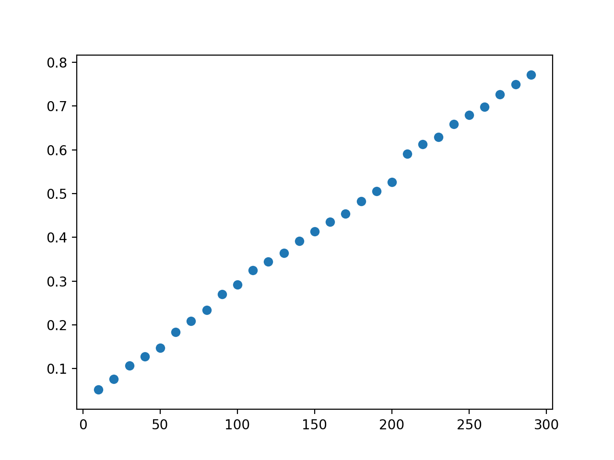
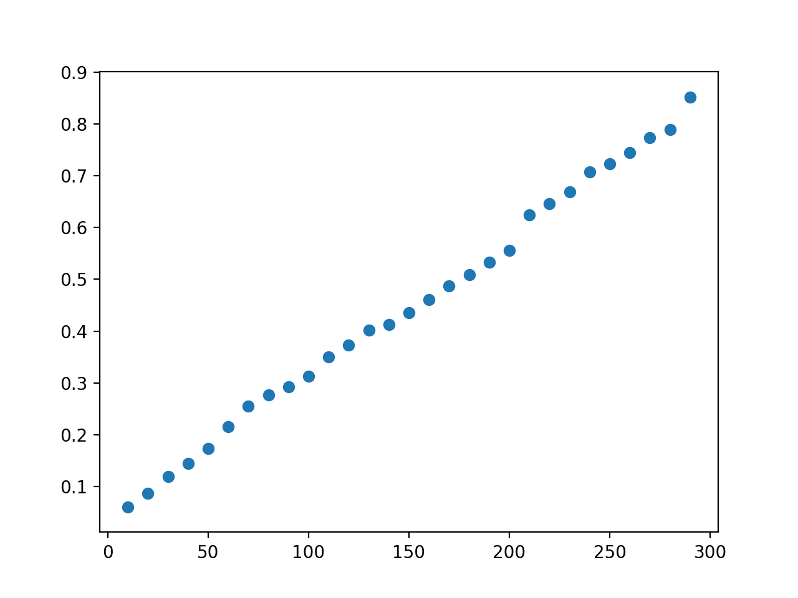

# Memoria de la práctica de Algoritmica y Complejidad
##### Autores: Ramon Escoda Semís y Marc Godia Calderó

## Índice 
1. Introducción
2. Algoritmo Iterativo
3. Algoritmo Recursivo
4. Requerimientos

## 1. Introducción 
En este documento vamos a analizar los costes de las implementaciones del algoritmo utilizados para encontrar la opcion optima del acueducto.  En concreto el algoritmo principal ha sido imlementado de forma iterativa y recursiva.

Por otro lado antes de continuar, cabe destacar que es necesario leer la sección de requerimientos antes de ejecutar el programa

El enlace de GitHub es el siguiente: https://github.com/rescoda7/Practica-1-Algoritmia

## Algoritmo iterativo
Para la obtención del puente con coste menor de forma iterativa se ha utilizado el algoritmo siguiente:
```
function iterative_find_best_aqueducte(aqueducte):
    points  <- aqueducte['points']
    height  <-  aqueducte['height']
    alpha   <-  aqueducte['alpha']
    beta    <-  aqueducte['beta']
    
    options <- lista de posibles opciones
    for option in options:
        if is_posible() == false: 
            continue # Si no es posible -> pasar siguiente opcion
        cost <- calculate_cost(option, height, alpha, beta)
        if best_option is None or cost < best_cost:
            best_cost   <- cost
            best_option <- option
        if best_cost == -1:
            return (None, -1)
        else:
            return (best_option, best_cost)        
```
Como se puede observar el algoritmo prueba todas las posibles opciones, donde comprueba si es posible y en caso afirmativo calcula el coste y en otro caso la ignora.

Con lo comentado anteriormente vamos a proceder con el analisis del coste algoritmico de esta implementación.

Como se ha dicho antes el algoritmo prueba todas los configuraciones posibles, como en esta práctica solo se consideran dos opciones, el algoritmo solo evaluará estas, es decir el bucle realizara dos iteraciones.

Por otro lado el coste de calcular el coste del aqueducto, puesto que tiene que recorrer los n puntos de la topologia del suelo de entrada el coste sera lineal O(n).

En cuanto al coste de validar si una opción es posible, a igual que el calculo del coste del aqueducto, se recorre lo n puntos, por lo tanto el coste tambien es lineal.

Con todo lo comentado anteriormente, si tenemos en cuenta el coste total en el peor de los casos(cuando todas las opciones son validas) el coste será:  
```
2 * (n + n) -> 4 * n -> O(n)
```
### Coste experimental de la versión iteratica

Como se observa el coste experiemtal es similar al teorico, con algun pico devido sobre todo a la carga de trabajo que tenga la CPU.

## Algoritmo recursivo
Para la obtención del puente con coste menor de forma iterativa se ha utilizado el algoritmo siguiente:
```
function recursive_find(options):
    if length(options) == 0:
        return None, -1  
    option <- columns_options[0] 
    if is_posible() == false:
        return recursive_find(options - first_option)
    current_cost <- calculate_cost(option)
    next_option, next_cost <- recursive_find(option - first_option)
    if next_option == None:
        return option, current_cost
    if current_cost < next_cost:
        return option, current_cost
    return next_option, next_cost
```
Como se puede observar en el pseudocodigo anterior, esta implementación en cada llamada recursiva evalua una opción de la lista de opciones del aqueducto, donde el caso base es cuando no quedan opciones por evaluar.

Tambien se puede observar que si un puente no es valido la llamada devolvera el resultado de la mejor opcion de las restantes no evaludadas.

Finalmente cada llamada recursiva compara el coste de la opción evaluada con la mejor de las opciones restantes que seran calculadas por las suguientes llamadas, si esta opción es mejor que la que ha evaludado, la llamada retornara esa opción, en caso contrario retornara la opción evaludad.

Respecto a los costes podemos obserbar que nuestra implementación con respecto a la version iterativa, realiza un llamada a la función mas que iteraciónes que realiza la versión iterativa. Esto es debido al caso base donde esta llamada se realiza cuando no quedan opciones por evaluar, por lo tanto el número de llamadas recursivas es 3.

Por otro lado respecto a los costes de evaluar si una una opción es es posible y calcular su coste no varia con respecto a la versión iterativa los cuales son n en ambos.

Con todo este analisis coste algoritmo total de esta implementacion sera:
```
2 * (n + n) + 1 = 4 * n + 1 -> O(n)
```
Como se puede observar el coste teorico de la versión recursiva es ligeramente superior al coste de la versión iterativa, devido a la llamda extra que realiza la recursiva.

### Coste experimental de la versión recursiva

Como se puede observar, a igula que la versión iterativa, el coste experimental es similar al coste teorico, con pequeños picos devido a la carga de CPU en cada momento. Por otro lado el coste experimental puede ser ligeramente superior a la de la iterativa, ya que realizar las llamadas a la función es mas costoso que realizar un bucle.

## Requerimientos
Antes de ejecutar el programa cabe destacar que se ha de asegurar de tener en el mismo directorio del programa el fichero python aqUtils.py, ya que algunas funcionalidades del programa requieren de este fichero.

Para obtener de forma grafica el puente de mejor coste calculado por el programa se ha de ejecutar el programa con el flag -g

```
python3 aqueducte.py -g <file>
```
